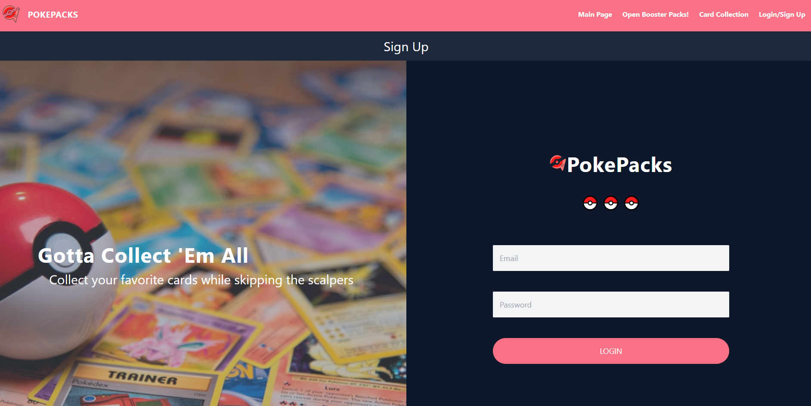
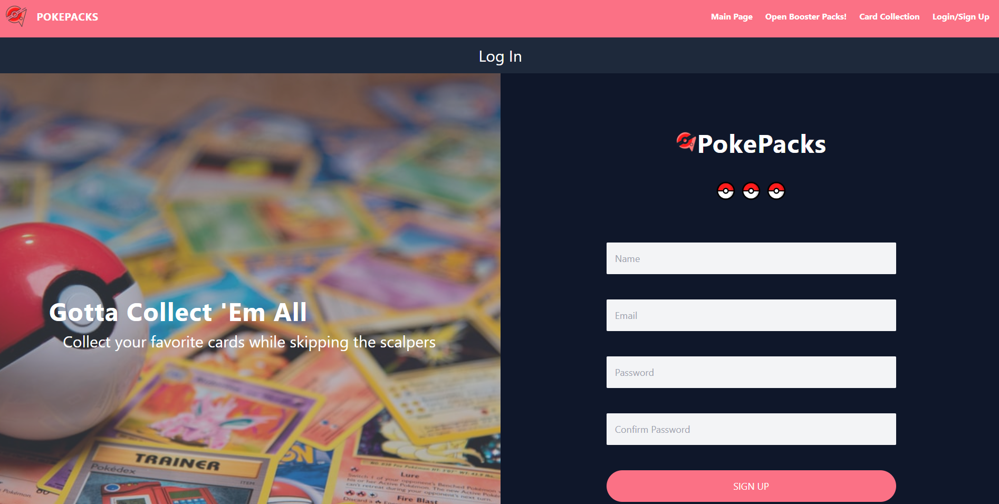
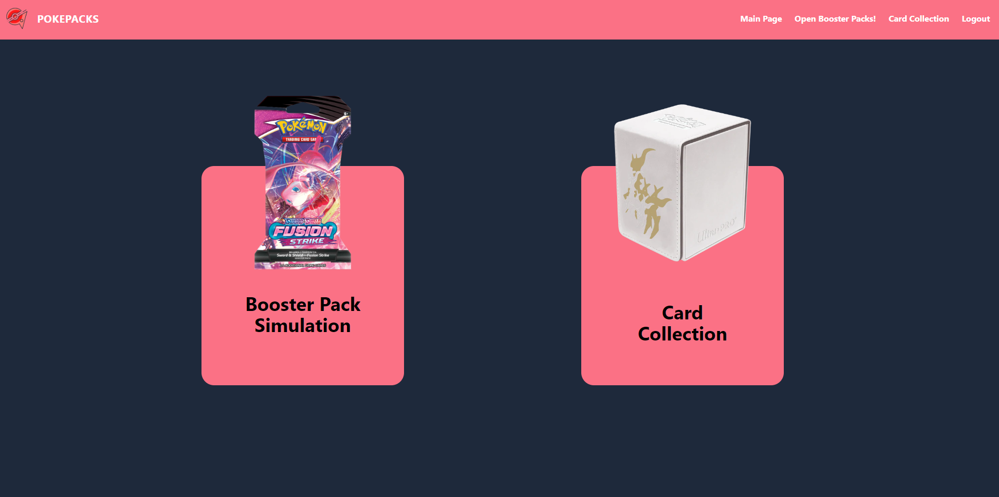
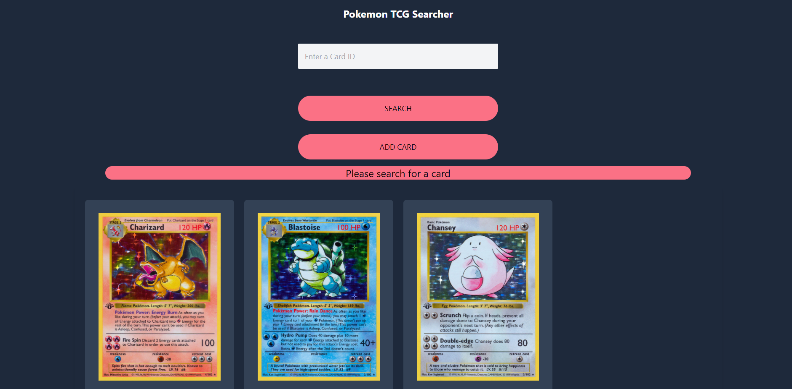
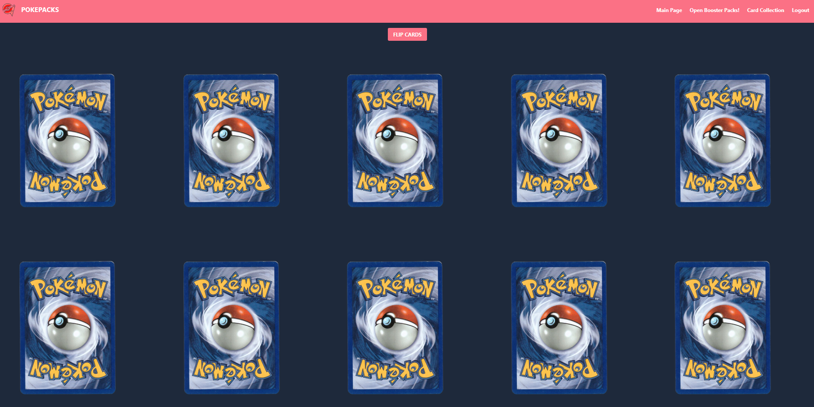
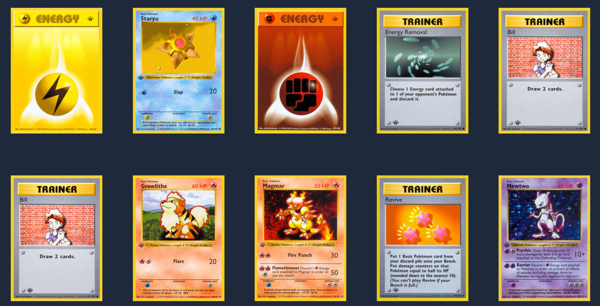

# PokePacks

Collect and Track all your favorite Pokemon Cards while skipping the scalpers

## About

PokePacks is a web app where you can simulate pack openings as well as track your collected cards for you to view 

### Getting Started 

Sign Up or Log In to begin and feel free to venture through the Booster Pack Opening Simulation section or the Card Collection section. 

In the Booster Pack Simulation you will be simulating a 10 card pack opening with the usual 8 Commons and 2 Rare cards.

In the Card Collection Section you can search for the cards in your collection and add them into our digital database 

### Screenshots

**Login Screen**

**Sign Up Screen**

**Main Page**

**Card Collection Screen**

**Booster Pack Simulation Screen**

### Technologies Used

 - React
 - Express
 - JavaScript
 - Tailwind CSS 
 - Pokemon TCG API 

### Future Updates 

- Instant Messaging 
- A Trading Feature
- Light/Dark Mode
- A "Want" or "Searching For" List

